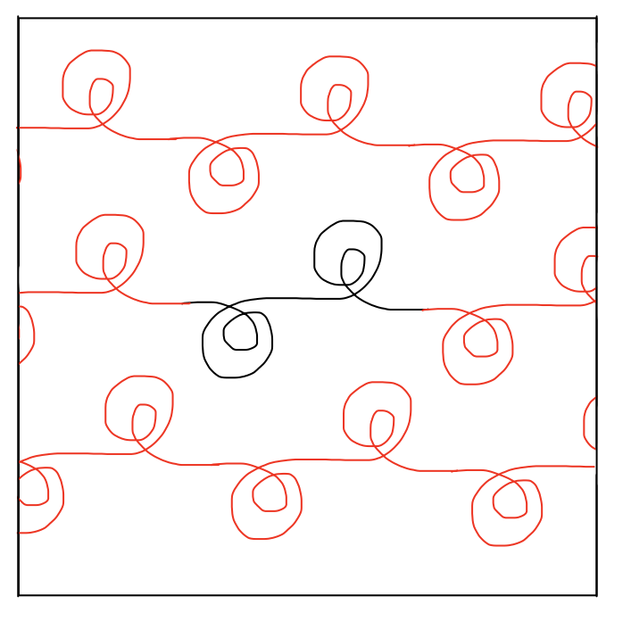

# Design notebook entry

## Last week's critique

My feedback on last week's work was mostly about gaps in my explanation and imaginings of
what the project is going to look like. So moving forward, I want to think more about what 
precisely a program looks like, and how to communicate errors to the user. Another piece of
feedback was the suggestion to use an internal rather than an external DSL for the drawing
component. As I've been thinking about the syntax this week, I'm thinking this actually
might be a good idea. I don't want to reinvent the wheel so to speak, but I would like to
make some elements of drawing with a turtle more clear or coherent for the users.

## Description

This week I spent a lot of time thinking about syntax and design decisions, and what tools
would help me implement the design the best and easiest. I did initially think that the drawing
part of the design would be more modular, but most of the syntax ideas I had felt too confusing,
and so I've gone back to a basic drawing with a turtle type program, since that's really what
it is and is the more fluent than what I was coming up with.

Fundamentally, most of the language part of this program is a drawing tool, just with a few
extra things. First, that it is only continuous line designs. Second, that the exit and entrance
points must be at the same height on the y-axis, and third, that it automatically propogates
horizontally and vertically to see the whole design.

My current syntax designs are below, along with a few sample programs. Straight
lines are pretty simple, but I had to think alot about what to do with curves and arcs. I
feel those are notorious for being awkward to code with a turtle, and I was unsure how
best to approach solving this issue for potential users. For the purposes of this week,
I wanted to focus on what would be "ideal" and so decided to try and abstract all the
tedious looping or angle changes abstracted using a function called "arc." I spent time thinking
about other shapes that might be helpful, but since these are line designs, this felt the
most simple way to still provide the user as much flexibility and creativity.

Program to generate the panto:

propogate: vertical

design:

turn left 90

draw 25

turn right 90

draw 50

turn left 90

draw 25

The elements of the program are the settings on where to start the drawing (in this case, it would be
default at 0) and then how the design is to be propogated. This one is just a vertical translation,
but there will also be options for flipping it, or flipping it as it moves horizontally across the design.

Then it has the the actual design, which is just simple turtle controls. Right now I have distances travelled
in relation to the total width of the screen, which is arbitrarily 100 units wide. I'm taking suggestions
on how to make that more fluent :) . 

Here is a slightly more complicated pantograph that uses arcs

propogate: vertical

design:

arc 180, radius 3

arc 180, radius 2

arc 180, radius 4

arc 60, radius 4

arc 30, radius 8

arc 270, radius 4

arc 180, radius 2

arc 180, radius 3

This is probably not a correct program, but the basic idea of the arc syntax is that it draws a arc
length given by the angle and the radius of the "circle" that this arc is from. I might tweak this
syntax a bit too, especially since for users who don't consider themselves mathematicall inclined
would be more comfortable thinking of this in terms of length or something, rather than angles and
radius. 

The other thing I spent a lot of time on this week was thinking about how to actually implement this.
I think the best way is using python, it has flexibility for internal vs external DSL, and has both
turtle and interface libraries that will make it easy to focus on the design part of the language.
I'm also very familiar with python as a language, so I don't have to spend a lot of time learning
the language.

## Questions

**What is the most pressing issue for your project? What design decision do
you need to make, what implementation issue are you trying to solve, or how
are you evaluating your design and implementation?**

I think I need to next focus time on what error handling and communication looks like for the user,
and whether I could do that visually (like marking where different lines connect together or something).
My other next step is to start working with the appropriate libraries, and get a simple
pantograph design working.

**What questions do you have for your critique partners? How can they best help
you?**

Right now I still I'm thinking in the mindspace of an external DSL, but if there are ideas
on how to shift that more into an internal space, I think that would make sense. I'd also
appreciate general feedback on the syntax, and whether arc makes sense.

**How much time did you spend on the project this week? If you're working in a
team, how did you share the work?**

I spent about five hours on this project this week, a lot of just thinking about ideas and scrapping
most of them, but I did set a timer so that it was focused think time.

**Compared to what you wrote in your contract about what you want to get out of this
project, how did this week go?**

I think this week went pretty well, I have a better footing of how I think the project
will get completed, and what end-products I'll be able to accomplish.
