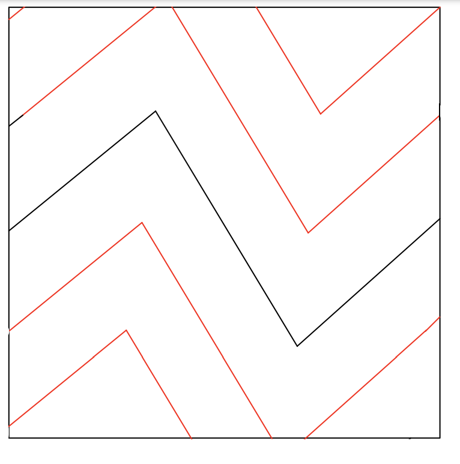

# Design notebook entry

## Last week's critique

My feedback on last week's work was mostly about gaps in my explanation and imaginings of
what the project is going to look like. So moving forward, I want to think more about what 
precisely a program looks like, and how to communicate errors to the user. Another piece of
feedback was the suggestion to use an internal rather than an external DSL for the drawing
component. As I've been thinking about the syntax this week, I'm thinking this actually
might be a good idea. I don't want to reinvent the wheel so to speak, but I would like to
make some elements of drawing with a turtle more clear or coherent for the users.

## Description

**TODO:** Fill in this part with information about your work this week:
important design decisions, changes to previous decisions, open questions,
exciting milestones, preliminary results, etc. Feel free to include images
(e.g., a sketch of the design or a screenshot of a running program), links to
code, and any other resources that you think will help clearly convey your
design process.

This week I spent a lot of time thinking about syntax and design decisions, and what tools
would help me implement the design the best and easiest. I did initially think that the drawing
part of the design would be more modular, but most of the syntax ideas I had felt too confusing,
and so I've gone back to a basic drawing with a turtle type program, since that's really what
it is and is the more fluent than what I was coming up with.

My current syntax designs are below, along with a few sample programs. Straight
lines are pretty simple, but I had to think alot about what to do with curves and arcs. I
feel those are notorious for being awkward to code with a turtle, and I was unsure how
best to approach solving this issue for potential users. For the purposes of this week,
I wanted to focus on what would be "ideal" and so decided to try and abstract all the
tedious looping or angle changes abstracted using a function called "arc." I spent time thinking
about other shapes that might be helpful, but since these are line designs, this felt the
most simple way to still provide the user as much flexibility and creativity.

## Questions

**What is the most pressing issue for your project? What design decision do
you need to make, what implementation issue are you trying to solve, or how
are you evaluating your design and implementation?**

**What questions do you have for your critique partners? How can they best help
you?**

**How much time did you spend on the project this week? If you're working in a
team, how did you share the work?**

**Compared to what you wrote in your contract about what you want to get out of this
project, how did this week go?**
