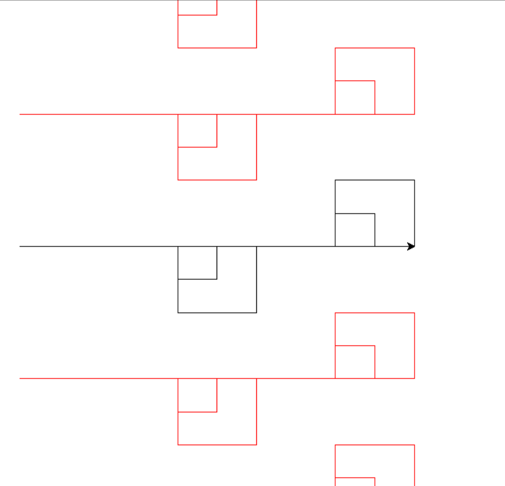
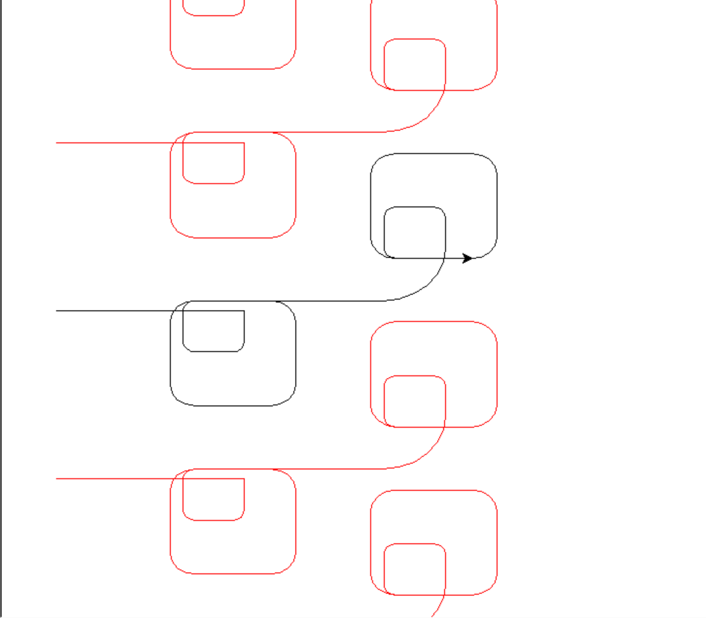
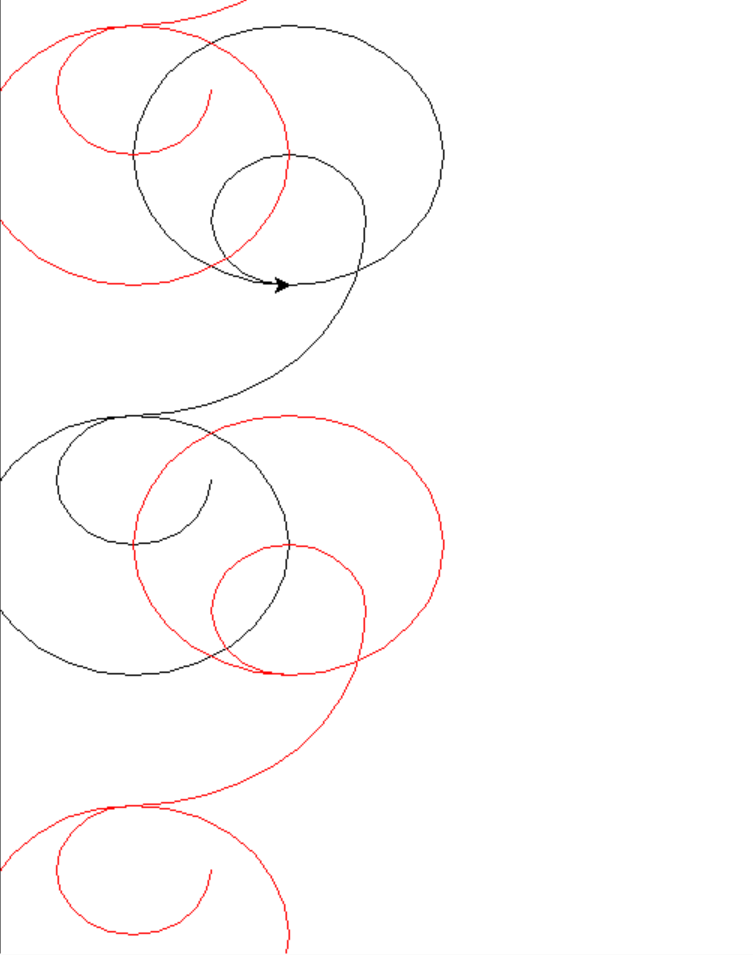

# Design notebook entry

## Last week's critique

Last week I got good critique and feedback on the planned implementation for arc and 
scaling. For the arc, it was good to get confirmation that it was a good direction made
out of fluency reasons for the user. For scale, it was good to discuss the purpose of 
having a scale functionality, and why the user would want it to be able to think about
the best way to implement it. I ended up going with what I initially thought of, in
discussion with my critique partners, that writing the program where the units of
measurements are inches for the syntax made the most sense, and then there is a way to
scale the size of the screen depending on how large the user wants the design to be.

## Description

**TODO:** Fill in this part with information about your work this week:
important design decisions, changes to previous decisions, open questions,
exciting milestones, preliminary results, etc. Feel free to include images
(e.g., a sketch of the design or a screenshot of a running program), links to
code, and any other resources that you think will help clearly convey your
design process.

I will start with the curve syntax, because I got something working! I initially
started by thinking about Bezier curves and how to implement those, but felt that it
was too complicated to try and get all of that information using a parse tree, and it
was unclear to me how to determine whether I needed a three or four point Bezier
curve, so I looked at other options. On the other end of the scale for implementation
options, I thought about simply curving the corner of the existing design - this made
a lot of sense because the idea is already that we're taking the design and "curving" 
it by some factor specified in the argument. The initial implementation had the
argument represent some radius for the curve, so the larger the radius the more curvy
it was. This worked, but I didn't like it because it wasn't proportional - a smaller
shape would be more like a loop compared to a larger shape. So then I made the 
argument represent a percent, and the radius is determined as a percent of the length
of the line that the arc originates in. This turned out much better, and as seen in
the examples below, the same code can give different designs where the only change
is the "curve" argument. These had 0, 25, and then 100 percent curve.

You can see in these however, it does drastically affect the size and position of
the objects. I've got a few ideas on potentially how to fix this, from a propagation
standpoint like by being able to rotate a design, or perhaps adding a new syntax
in the language to make sure a line is straight even if curve is not 0. 

I also implemented a way to change the spacing of the different drawings, within an
inch type scale, and also implemented a way to change the scale. However, it currently
only does increases by a whole number and keeps both sides the same. So, the default
is 12 x 12 inches, and it can only do 24 x 24, 36 x 36 ... etc. I think I need to add
a second argument here so that someone can expand their function

## Questions

**What is the most pressing issue for your project? What design decision do
you need to make, what implementation issue are you trying to solve, or how
are you evaluating your design and implementation?**

**What questions do you have for your critique partners? How can they best help
you?**

**How much time did you spend on the project this week? If you're working in a
team, how did you share the work?**

**Compared to what you wrote in your contract about what you want to get out of this
project, how did this week go?**
