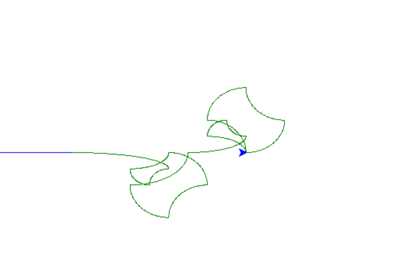

# Design notebook entry

## Last week's critique

The critique I recieved last week was mostly in reference to my curve implementation.
The pull request critique was a little late, but the in-class feedback I got was really
helpful, and helped me find a new direction for the curve that doesn't lose the
design choices that I made. I like the idea of bounding the curve by the points
a lot better, but it does make some of the implementation a bit more tricky.

## Description

This week I mostly worked on parser errors and the new curve implementation.
I also tried to improve the scale functionality a bit to allow for non-square
screens and for non-integer numbers. Both of those I had some issues with, and due to
time and proritization I ended up benching that for now.

For parser errors, ANTLR errors are kind of tricky to implement, and it took me
a while to figure out what in the documentation I was even looking for. Several
semenatic errors I have warnings for in the code, or is easy to debug visually 
because the design will look funky. For parser errors themselves I added a custom
parser listener to help give errors that are slightly more specific about which line
and which symbols threw the errors, which ideally will allow users to debug parser
errors more efficiently.

The new curve implementation is where I spent most of my time this week. I'm not
super happy with it, and it doesn't ~quite~ work yet, but right now it does a pass
through the parse tree to grab all the points of the original design, and then goes
through the points and when it turns corners, draws a quarter-ellipse.

Currently, it is bounded by the correct points, but doesn't draw the correct type
of arc to form a circle, as shown below. Hopefully I'll get this done by class,
but it wasn't going to happen by midnight tonight. :)

## Questions

**What is the most pressing issue for your project? What design decision do
you need to make, what implementation issue are you trying to solve, or how
are you evaluating your design and implementation?**

This week I need to finish the curve implementation, and then pack up the 
project for an ostensible user. (Documentation, build instructions, etc).
I think those are doable, but still will require a bit of time and though.
I think if those features are complete, the code is clean and documented,
and there are instructions for a user than I will be happy with my project.

**What questions do you have for your critique partners? How can they best help
you?**

I don't have anything right now - I may ask some questions in class though.

**How much time did you spend on the project this week? If you're working in a
team, how did you share the work?**

Unfortunately, because of the ballroom concert this weekend and clinic code freeze
I did not get to spend as much time as I wanted to on this project. I probably 
worked about 6 hours on this, which less time than I have previously been able 
to put in.

**Compared to what you wrote in your contract about what you want to get out of this
project, how did this week go?**

I'm excited about the direction of the new curve implementation, and I think
I will have the features working to have a minimum working language, but I think
when I wrote my contract I was hoping to be a little more done with it, and so I
am still a little disappointed that curve isn't done and I don't have the whole
week to test and put finishing touches on it.
